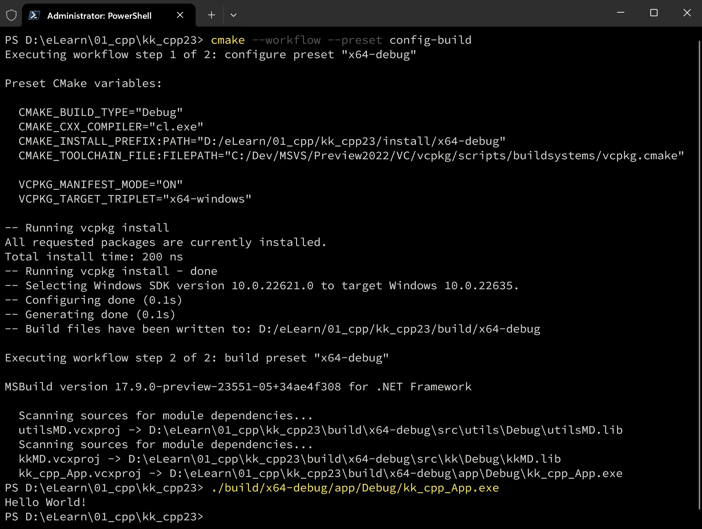

# KK C++
## Brief
As of now, you should be able to build the project with a single command by making use of **CMakePresets**. For that, you'll need:
- CMake 3.28 - download at [Kitware](https://cmake.org/download/)
- [Visual Studio 17 2022](https://learn.microsoft.com/en-us/visualstudio/releases/2022/release-notes-preview)
	+ I am using the [latest preview](https://visualstudio.microsoft.com/thank-you-downloading-visual-studio/?ch=pre&sku=community&rel=17) version 17.9.0 Preview 1.0
- The [vcpkg](https://github.com/Microsoft/vcpkg) Package Manager
	+ this project doesn't doesn't use vcpkg to manage its dependencies yet, but it will.
## Build
From the root directory, open your VS Developer PowerShell and run:
`cmake --workflow --preset config-build`

Here's a screenshot:

## PS
- There are some files that aren't involved in this test structure yet, such as the ones from `./extern`, `./tests`, `./cmake`, as well as vcpkg's manifest file [`vcpkg.json`] and so on. I was experimenting with some other stuff, upon which I'll build this repo.
That being said, ignore them for now.
- You can also open the project in Visual Studio 17 2022. For that,
	+ change the Presets version in the `CMakePresets.json` file from `8` to `6`
	+ also, make sure you check the vcpkg box when installing Visual Studio.
	+ You don't need to install CMake with Visual Studio. Download CMake separately, and then, in the Visual Studio Settings, go to the CMake tab and choose to use a custom CMake executable, and point to the `cmake.exe` that you got when you installed CMake or unzipped it.
	+ From Visual Studio, go to `File | Open | CMake` and choose the root `CMakeLists.txt`